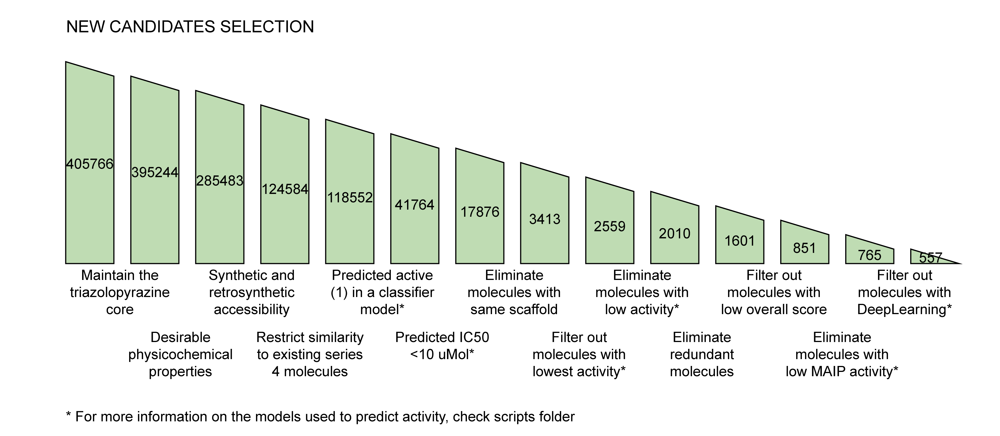

## OSM Series 4 Candidates with Deep Generative Models - Round 2

A new round of series 4 candidates for the [Open Source Malaria Project](https://github.com/opensourcemalaria), including molecules generated from low-data generative models (adapted from the [ETH Modlab](https://github.com/ETHmodlab/virtual_libraries)) and molecules generated in a second round using the [Reinvent 2.0](https://github.com/MolecularAI/Reinvent) generative model with improved activity predictors.

## Data

- All 405766 molecules generated (with duplicates eliminated) can be found [here](https://github.com/ersilia-os/osm-series4-candidates-2/blob/main/scripts/results/data_0.csv)
- Selection of best 557 candidates according to the pipeline below, rendered the following [molecules](https://github.com/ersilia-os/osm-series4-candidates-2/blob/main/scripts/results/data_13.csv)
- A final list of the **best** 90 candidates based on activity can be found [here](https://github.com/ersilia-os/osm-series4-candidates-2/blob/main/scripts/results/eosi_s4_candidates_90.csv)

## Results Columns
The molecules are presented in an excel file containing the following columns:
Identification
- EosID: ID number from Ersilia Open Source Initiative
- InchiKey
- Smiles
Activity predictions
- IC50Pred: the lower the better. It is probably biased towards high values, so hopefully it is a conservative estimate. Includes confidence interval (Upper Bound (UB) and Lower Bound (LB))
- DeepActivity: the higher the better. It is a composite z-score between several deep learning scores (chemprop, grover; trained on classification and regression tasks). Includes confidence interval (Upper Bound (UB) and Lower Bound (LB))
- Maip: Activity prediction using the [MAIP tool](https://www.ebi.ac.uk/chembl/maip/)
- WhalesDist3Act:
Similarity to series 4
- Similarity: tanimoto similarity to known series 4 compounds
Accessibility:
- SAScore: synthetic accessibility
- RAScore: retrosynthetic accessibility as predicted by the [Reymond lab](https://github.com/reymond-group/RAscore)
-SybaScore: fragment-based accessibility score (https://jcheminf.biomedcentral.com/articles/10.1186/s13321-020-00439-2)
Physicochemical properties:
- SLogP: Solubility
- QED: drug-likeness
- NumRings: number of rings in the molecule
- FractionCSP3: number of tertiary carbons
- FrHalogen: number of halogen groups
- HeavyAtom: heavy atom count
- Rotatable: number of rotatable bonds
- Heteroatoms: number of Heteroatoms
- FrAlkylHalide: fragments containing Halides
Molecular structure (1: existing, 0: not existing):
- TriazoloHeteroaryl: contains an heteroaryl ring in the RHS
- TriazoloPhenyl: contains a phenyl (no heteroatoms) in the RHS
- TriazoloHeteroaryl - Para / - Meta / - Orto: contain substituents in para, meta or orto positions

## Molecule generation

A first batch of molecules were generated in May2021 using the Reinvent 2.0 model. A detailed explanation as well as results analysis of this first round can be found in our GitHub repo [osm-series4-candidates](https://github.com/ersilia-os/osm-series4-candidates). We generated 116728 new series 4 candidates.
A second batch of molecules (209310) has been generated for the purposes of this analysis using the Reinvent2.0 tool in exploration mode (optimizing for activity based on a simple QSAR model build with RDKIT descriptors).
A third batch of molecules (150365) has been generated using a low-data generative model.

## Selection of best candidates

All unique final molecules (405766) have undergone a recursive selection process based on physicochemical properties, synthetic accessibility and predicted activity as follows:

## Run pipeline

For transparency and reproducibility, we provide code to run the full pipeline for candidate selection. Please download and uncompress the following folders:

* [chemprop](https://drive.google.com/file/d/1WDN3NRTC4T98f-6St9YT8wDXO8foZOg5/view?usp=sharing)
* [grover](https://drive.google.com/file/d/11_zSh1635KcP6GGgiVTozmE96A1N-z-U/view?usp=sharing)

The notebook with the process to select the best 90 candidates can be found [here](https://deepnote.com/project/Open-Source-Malaria-Series-4-Round-2-Zq8tjyh_Q4qjsK0NKdSk0A/%2Feosi_s4_candidates_90.csv).
