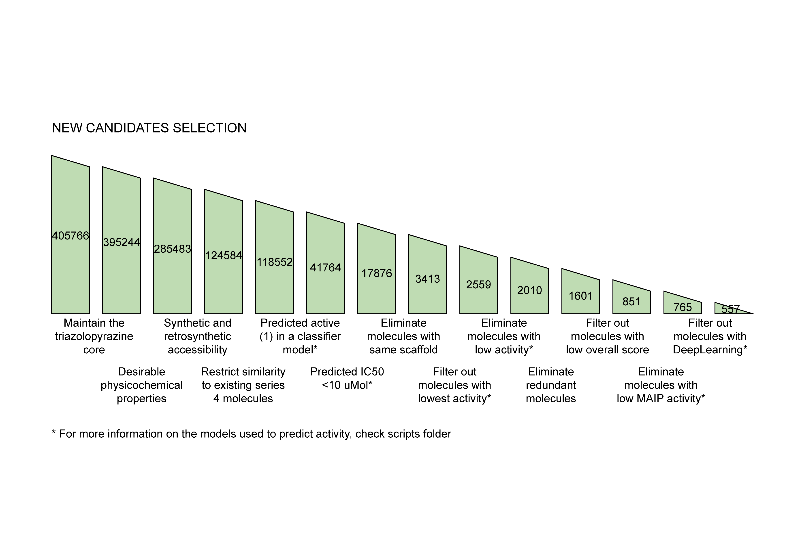

# osm-series4-candidates-2
A new round of series 4 candidates for the [Open Source Malaria Project](https://github.com/opensourcemalaria), including molecules generated from low-data generative models (adapted from the [ETH Modlab](https://github.com/ETHmodlab/virtual_libraries)) and molecules generated in a second round using the [Reinvent 2.0](https://github.com/MolecularAI/Reinvent) generative model with improved activity predictors.

## Molecule generation
A first batch of molecules were generated in May2021 using the Reinvent 2.0 model. A detailed explanation as well as results analysis of this first round can be found in our github repo [osm-series4-candidates](https://github.com/ersilia-os/osm-series4-candidates). We generated 116728 new series 4 candidates.
A second batch of molecules (209310) has been generated for the purposes of this analysis using the Reinvent2.0 model that used as activity prediction a Support Vector Classification model (with 0.8 accuracy in test/train sets).
A third batch of molecules (150365) has been generated using a low-data generative model.

## Selection of best candidates
All unique final molecules (405766) have undergone a recursive selection process based on physicochemical properties, synthetic accessibility and predicted activity as follows:

## Run pipeline

For transparency and reproducibility, we provide code to run the full pipeline for candidate selection. Please download and uncompress the following folders:

* [chemprop](https://drive.google.com/file/d/1WDN3NRTC4T98f-6St9YT8wDXO8foZOg5/view?usp=sharing)
* [grover](https://drive.google.com/file/d/11_zSh1635KcP6GGgiVTozmE96A1N-z-U/view?usp=sharing)
